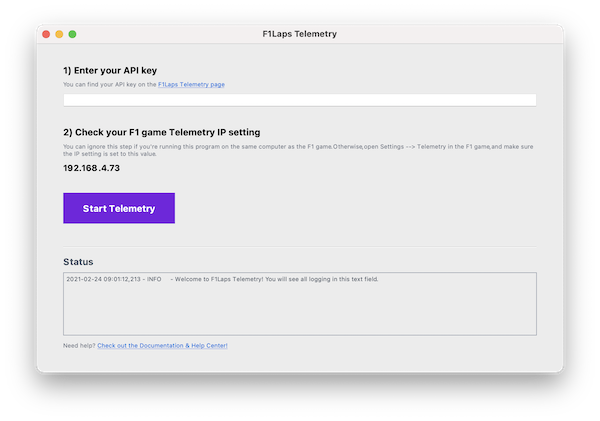

# F1Laps Telemetry Sync


This package lets you sync F1 game data into [F1Laps](https://www.f1laps.com) automatically. It receives telemetry packets via the UDP protocol in your local network.



## Requirements & Installation

* Python 3
* Package requirements, see requirements.txt

For more detailed installation help, please check out our comprehensive documentation here:

**[F1Laps Telemetry Sync User Documentation](https://www.notion.so/F1Laps-Telemetry-Documentation-55ad605471624066aa67bdd45543eaf7)**

## Configuration

Set your F1Laps API key in the config.py. You can get your API key from [https://www.f1laps.com/api/telemetry_apps](https://www.f1laps.com/api/telemetry_apps).
```python
F1LAPS_API_KEY = "YOUR_API_KEY"
```

In your F1 game settings (Settings > Telemetry), make sure to change the Telemetry IP according to your machine's IP address. Keep the port to the default value.

## Testing

You can run all unit tests with this command:
```bash
python3 -m unittest discover
```

## Desktop Apps

You can build Mac and Windows apps via PyInstaller, which offer a graphical user interface for running this script.

**Mac** 

```bash
pyinstaller f1lapsapp.py -F -w -i app-icon.icns
```

**Windows** 

```bash
pyinstaller f1lapsapp.py -F -w -i app-icon.ico
```

**Commands**

* `-F`: creates a one-file bundled executable
* `-w`: do not provide a console window
* `-i app-icon.icns`: use F1Laps app icon

## Credits & Contributions

This repository was heavily inspired and contributed to by:
* [Redditor _jsplit](https://www.reddit.com/user/_jsplit)
* [gparent's f1-2020-telemetry package](https://gitlab.com/gparent/f1-2020-telemetry/)
